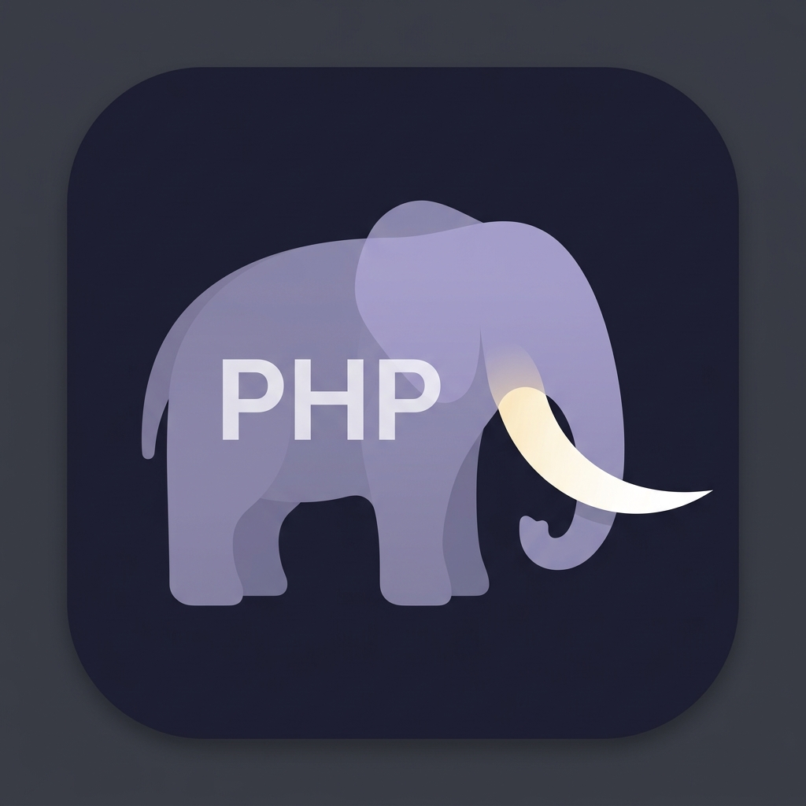

<p align="center">
  
</p>

<h1 align="center">Tusk PHP</h1>

<p align="center">
  <a href="https://github.com/open-southeners/tusk-php/actions/workflows/test.yml"></a>
  <a href="https://github.com/open-southeners/tusk-php/actions/workflows/release.yml"></a>
  <a href="https://codecov.io/gh/open-southeners/tusk-php"></a>
  <a href="https://github.com/open-southeners/tusk-php/releases/latest"></a>
  <a href="LICENSE"></a>
  
</p>

<p align="center">
  A high-performance PHP language server written in Go, with framework-aware Laravel and Symfony intelligence.
</p>

## Intelligent Completions

Context-aware suggestions that understand your code. Method chains resolve through return types and `@return` docblocks, so `Category::query()->with('tags')->where()->` shows the right `Builder` methods, not random matches from vendor.

- **Member access** (`->`, `::`, `?->`) with full chain resolution
- **Auto-import** — selecting a class automatically adds the `use` statement
- **Smart parens** — skips adding `()` when they already exist
- **Container bindings** — `app('request')->` completes with `Request` methods
- **Config keys** — `config('database.')` navigates with dot-notation
- **Array shapes** — `$config['']` completes keys from `@var` annotations and literal arrays
- **`new`, `use`, type hints, attributes, pipe operator `|>`**

## Hover & Navigation

- **Hover** — type signatures, docblock summaries, inheritance info, container bindings
- **PHP Manual Links** — hover on built-in functions, classes, methods, properties, and constants includes a link to the php.net manual page. Optionally configure `php_manual_open_on_definition` to make Cmd+Click open the page in your browser.
- **Go to Definition** — jump to classes, methods, properties, functions, container bindings, framework string references
- **Go to Type Definition** — resolve container services and member types to concrete declarations
- **Go to Implementation** — find implementations for interfaces and abstract contracts
- **Find References** — all usages across the workspace, including member access chains
- **Document Symbols** — full file outline with classes, methods, properties, constants
- **Workspace Symbols** — search indexed classes, members, functions, and constants across the project
- **Document Highlights** — highlight declaration, read, and write occurrences in the current file
- **Folding Ranges** — fold namespaces, declarations, arrays, comments, and nested regions
- **Signature Help** — parameter hints while typing function calls
- **Rename** — rename variables (scoped), classes, methods, properties across the workspace

## Inlay Hints

Inline hints are enabled by default for:

- inferred local variable types
- `foreach` key and value types
- closure return types
- method return types from PHPDoc
- call-site parameter names

## Refactoring

- **Copy Namespace** — copy the fully qualified name of the current file's class
- **Move to Namespace** — move a class to a different namespace, updating all references and the file path per PSR-4
- **Import Code Actions** — remove unused imports, organize imports, and import unknown classes
- **Generate Code** — implement missing methods, generate constructors, and generate safe getters/setters
- **Local Refactors** — extract a selected expression to a variable and inline safe single-assignment variables

## Diagnostics

Built-in static analysis rules run on every change (fast checks) or on save (heavier checks). All rules are individually configurable.

| Rule | Code | Severity | Runs on |
|------|------|----------|---------|
| Unused imports | `unused-import` | Hint | Change |
| Unused private methods | `unused-private-method` | Info | Change |
| Unused private properties | `unused-private-property` | Hint | Change |
| Unreachable code | `unreachable-code` | Warning | Change |
| Redundant union members | `redundant-union-member` | Info | Change |
| Redundant nullsafe `?->` | `redundant-nullsafe` | Info | Save |
| Unknown column in Builder | `unknown-column` | Warning | Save |
| Unknown relation in Builder | `unknown-relation` | Warning | Save |
| Unknown class | `unknown-class` | Warning | Change |
| Unknown function | `unknown-function` | Warning | Change |
| Unknown member | `unknown-member` | Warning | Change |
| Deprecated PHP functions | `deprecated` | Warning | Change |
| Abstract method in concrete class | `abstract-in-concrete` | Error | Change |

Unused imports and unused private members are tagged as `Unnecessary` (editors grey them out). Deprecated functions are tagged as `Deprecated` (editors strike them through).

External tool integrations:

- **PHPStan** — runs on save, shows errors inline (requires PHPStan in your project)
- **Laravel Pint** — formatting diagnostics on save (requires Pint in your project)

## Framework Intelligence

### Laravel

Scans service providers for `bind()` / `singleton()` calls and pre-loads 25+ core framework bindings. Completions and go-to-definition work through:

- `app('request')`, `resolve(Cache::class)`, `$this->app->make(...)`
- `config()` with dot-notation key navigation and value preview
- Eloquent method chains: `Model::query()->with()->where()->get()`
- route names, view names, and translation keys with completion and go-to-definition
- Interface-to-concrete resolution from container bindings

### Symfony

Parses `services.yaml`, PHP service configs, route config, and autowiring attributes:

- `#[Autowire]`, `#[AsController]`, `#[AsCommand]`, `#[AsEventListener]`, `#[AsMessageHandler]`
- Auto-wired services from `src/`
- `$container->get(...)` with registered service completions and service/type definition navigation
- route names from controller attributes and `config/routes.{yaml,yml,xml}` imports
- Interface-to-concrete resolution from `implements` declarations

### PHP 8.0 - 8.5

Full support for modern PHP syntax: union/intersection/DNF types, enums, fibers, readonly classes, match expressions, named arguments, attributes, property hooks, asymmetric visibility, typed constants, pipe operator `|>`.

## Installation

### VS Code / VS Codium

Install the extension from the registry used by your editor:

- [VS Code Marketplace](https://marketplace.visualstudio.com/items?itemName=open-southeners.tusk-php) for Visual Studio Code.
- [Open VSX Registry](https://open-vsx.org/extension/open-southeners/tusk-php) for VS Codium and other Open VSX-based editors.

VS Code can also install it from the command palette or CLI:

```
ext install open-southeners.tusk-php
```

The extension bundles the language server binary — no additional setup required.

### Zed

Search for **"Tusk PHP"** in `zed: extensions`. The extension automatically downloads the correct binary for your platform.

Keep Zed's built-in **PHP** extension installed. It provides syntax highlighting, PHPDoc highlighting, and other language assets. Install **Tusk PHP** alongside it, then set Tusk PHP as the only PHP language server to avoid collisions with Phpactor, Intelephense, or PHP Tools:

```json
{
  "languages": {
    "PHP": {
      "language_servers": ["tusk-php"]
    }
  }
}
```

Use Zed's `lsp: restart language servers` action after changing settings or reinstalling the dev extension.

Zed-specific Tusk PHP settings can be passed through `lsp.tusk-php`:

```json
{
  "lsp": {
    "tusk-php": {
      "binary": {
        "path": "/absolute/path/to/tusk-php",
        "arguments": ["--transport", "stdio"]
      },
      "initialization_options": {
        "phpVersion": "8.5",
        "framework": "auto",
        "containerAware": true,
        "diagnosticsEnabled": true,
        "phpstanEnabled": true,
        "phpstanPath": "",
        "phpstanLevel": "",
        "phpstanConfig": "",
        "pintEnabled": true,
        "pintPath": "",
        "pintConfig": "",
        "maxIndexFiles": 10000,
        "excludePaths": ["vendor", "node_modules", ".git", "storage", "var/cache"]
      }
    }
  }
}
```

For local language-server development, build the binary with `make build` and
set `lsp.tusk-php.binary.path` to the absolute path of `build/tusk-php`; Zed
will use that binary instead of downloading the release artifact. See
[CONTRIBUTING.md](CONTRIBUTING.md#testing-with-zed) for the full local Zed
testing workflow.

The Zed extension also provides Assistant slash commands:

```text
/tusk-copy-namespace app/Models/User.php
/tusk-namespace-for-path app/Models/User.php
```

Zed does not expose the same extension command API as VS Code, so `Restart Server` maps to Zed's built-in `lsp: restart language servers` action, and `Move to Namespace...` is not yet exposed as a Zed command.

### Neovim

Install the binary (see below), then add to your config:

```lua
require('lspconfig.configs').php_lsp = {
  default_config = {
    cmd = { 'tusk-php', '--transport', 'stdio' },
    filetypes = { 'php' },
    root_dir = require('lspconfig.util').root_pattern('composer.json', '.git'),
  }
}
require('lspconfig').php_lsp.setup({})
```

### Other Editors

Any LSP client works. The server uses **stdio** with JSON-RPC 2.0:

```bash
tusk-php --transport stdio
```

### Binary Installation

**Download** from [GitHub Releases](https://github.com/open-southeners/tusk-php/releases/latest) (Linux, macOS, Windows — amd64/arm64).

**Quick install** (Linux / macOS):

```bash
curl -fsSL https://raw.githubusercontent.com/open-southeners/tusk-php/main/scripts/install.sh | bash
```

**From source** (requires Go 1.22+):

```bash
git clone https://github.com/open-southeners/tusk-php.git && cd tusk-php && make install
```

## Configuration

### Editor Settings (VS Code)

| Setting | Default | Description |
|---------|---------|-------------|
| `tuskPhpLsp.enable` | `true` | Enable/disable the extension |
| `tuskPhpLsp.executablePath` | `""` | Custom path to the binary |
| `tuskPhpLsp.phpVersion` | `"8.5"` | Target PHP version (`8.0`-`8.5`) |
| `tuskPhpLsp.framework` | `"auto"` | Framework: `auto`, `laravel`, `symfony`, `none` |
| `tuskPhpLsp.containerAware` | `true` | Enable DI container analysis |
| `tuskPhpLsp.diagnostics.enable` | `true` | Enable diagnostics |
| `tuskPhpLsp.diagnostics.phpstan.enable` | `true` | Run PHPStan on save |
| `tuskPhpLsp.diagnostics.pint.enable` | `true` | Run Laravel Pint on save |
| `tuskPhpLsp.maxIndexFiles` | `10000` | Maximum PHP files to index |
| `tuskPhpLsp.excludePaths` | `["vendor", ...]` | Paths to skip when indexing |
| `tuskPhpLsp.phpManual.locale` | `""` | Locale for php.net manual links (`en`, `de`, `es`, `fr`, `it`, `ja`, `pt_BR`, `ru`, `tr`, `zh`). Empty = English. |
| `tuskPhpLsp.phpManual.openOnDefinition` | `false` | Cmd+Click on a built-in opens its php.net page in your browser. |

### Project Configuration

Create `.tusk-php.json` in your project root to override settings per project:

```json
{
  "phpVersion": "8.5",
  "framework": "auto",
  "containerAware": true,
  "diagnosticsEnabled": true,
  "excludePaths": ["vendor", "node_modules", ".git"],
  "maxIndexFiles": 10000,
  "php_manual_locale": "",
  "php_manual_open_on_definition": false,
  "diagnosticRules": {
    "unused-import": true,
    "unused-private-method": true,
    "unused-private-property": true,
    "unreachable-code": true,
    "redundant-nullsafe": true,
    "redundant-union-member": true,
    "unknown-column": true,
    "unknown-relation": true,
    "unknown-class": true,
    "unknown-function": true,
    "unknown-member": true
  },
  "inlayHints": {
    "enabled": true,
    "variableTypes": true,
    "foreachTypes": true,
    "closureReturnTypes": true,
    "returnTypes": true,
    "parameterNames": true
  }
}
```

All diagnostic rules are enabled by default. Set a rule to `false` to disable it. Framework is auto-detected from `artisan` (Laravel), `bin/console` (Symfony), or `composer.json`.

## Contributing

See [CONTRIBUTING.md](CONTRIBUTING.md) for development setup and guidelines.

## License

[MIT](LICENSE)
